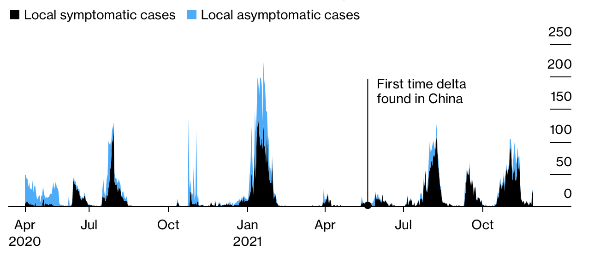

# 中国受益于奥密克戎病毒导致的边境关闭
继新冠病毒变种"奥密克戎"出现以来，本周世界各国逐渐限制边境和航运。但是在中国，航运和边境如往常一样繁忙。

然而科学家们竞相猜测，南非的新冠病毒变种第一个序列是否会导致它比具有高度传染性的德尔塔病毒更令人担忧，从英国到以色列到日本，各国对边境管制变得谨慎。他们提前防御并限制航运，以此将编译病毒拒之国门，而不是期望奥密克戎会昙花一现。北京方面无需对此担忧。

病毒高突变形式的出现为中国的新冠零容忍政策提供了辩护，中国看到了在疫情初期严格封锁边境，并那时起加强严格控制。当欠他中心地区还在与病毒共存的时候，中国可以率先清楚每一次持续感染，这就是所谓的人民的健康就是最大的人权，经济利益也要服从于此。

## 新冠疫苗注射
"奥密克戎是新冠病毒的加强剂"，纽约国际关系委员会高级研究员黄彦忠指出，”如果西方国家反复开启关闭边境，他们将无法指控中国那种所谓无法容忍和错误的方式。“

其他国家选择航行和边境封锁使得人们重新思考中国的疫情策略是不是能更有成效的预防突变病毒，特别是最近几天这些国家没完全理解新冠风险，也没有掌握如何远离新冠疫情。一家具有政府背景的新闻媒体-环球时代，已经声明中国最有可能避免奥秘科通病毒的破坏。

当判断整处于奥密克戎令人惊讶的基因变化是否会调整特权时，一些分析指出，中国的策略或许更有成效。高盛公司战略研究员`Kinger Lau`指出，全球第二大经济体的经济基本面和疫情控制是的中国面临新变异病毒更有地位。

至今，中国仍在坚持零容忍政策，承受着越来越多的国内外批判，同时超越了死板的边境关闭政策战线是一种开创性的控制能力。

## 更难控制

德尔塔变异病毒的影响在中国越来越重视。

> 来源：国家健康委员会
> 
> 注：数据开始于2020年4月18日，在政府正确对新冠疫情统计之后。有些数据上报两次，例如早期无症状感染者发展为由症状。

当中国作为世界上人口最多的国家挡住了德尔塔病毒猖獗的传染，并且大量死亡来自于世界其他国家时，零容忍政策成为中国政府和人民的负担，持续数周的隔离和重进程序以为着人们收到国内封锁的影响。

